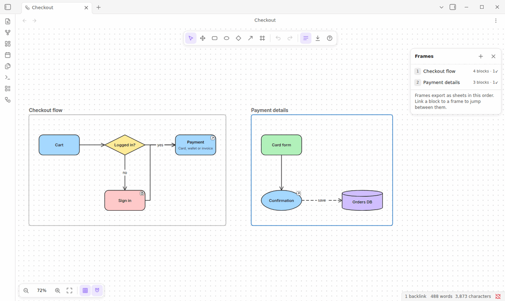

# Block Draw for Obsidian

Draw block diagrams in Obsidian: titled blocks, links and frames. Then present them, or export to **Google Sheets**, **Excel**, **JSON**, **SVG** or **PNG**.

## Features

- **Draw fast**: infinite canvas, grid and snapping, undo/redo, single-key shortcuts. Eight shapes; elbow, straight or curved links; frames that group blocks; blocks that contain other blocks.
- **Link everything**: link a block to a frame, a note, another drawing or a URL, and jump with Ctrl/Cmd+click. Show a drawing in a note with a `blockdraw` code block or a `[[Drawing.blockdraw#Frame]]` link.
- **Look sharp**: one-click themes (3D, Minimal, Futuristic, Classic), palettes, a 3D effect, ten business fonts, and text aligned left, center or right, top, middle or bottom.
- **Explain**: tags (“Service · Java”), plus comments and descriptions that you can show or hide, also while presenting.
- **Present**: press **P** for a full-screen slideshow, one slide per frame, with a laser pointer. Click a block to spotlight what it depends on.
- **Show data flow**: animated flow along links, running both ways on two-way links.
- **Export**: Google Sheets (one tab per frame), Excel, JSON, SVG and PNG.
- Works offline, follows your light or dark theme, and runs on desktop and mobile.

## Install

Block Draw needs Obsidian 1.5 or later.

- **Community plugins**: open **Settings → Community plugins → Browse**, search for **Block Draw** and install it.
- **Manual**: download `main.js`, `manifest.json` and `styles.css` from the [latest release](https://github.com/sudesh309/Block-Draw/releases/latest) into `<your vault>/.obsidian/plugins/block-draw/`, then in Obsidian open **Settings → Community plugins**, turn off restricted mode if needed, click the reload button next to **Installed plugins**, and enable **Block Draw**.
- **BRAT**: add `sudesh309/Block-Draw` as a beta plugin.
- **From source**: `npm install && npm run build`, then copy the three files as above.

## Quick start

1. Click the ribbon icon or run **Block Draw: Create new drawing**. Drawings are `.blockdraw` files.
2. Double-click the canvas to add a block and type its title. Press Enter to finish.
3. Hover the block, drag a dot from its edge and release on empty space: a connected block appears, ready for its title.
4. Press **F** and drag around some blocks to put them in a frame. Name the frame right away.
5. Select a block and pick a frame in **Link** (left panel) to link them. Ctrl/Cmd+click the block to jump.
6. Open the **Export** menu (toolbar download icon, the tab's ⋯ menu, or the command palette), or press **P** to present.

Press **?** in the editor for all keyboard shortcuts.

## Google Sheets export

Exports go through an Apps Script web app that you deploy in your own Google account (works on desktop and mobile, no Google Cloud project needed), or through a Google sign-in on desktop. Set it up under **Settings → Block Draw → Google Sheets**; the steps are in the [design doc](docs/DESIGN.md#setting-up-google-sheets-export).

## Network use and privacy

Block Draw works offline and contacts nothing by default. It uses the network only to Google, and only when you ask:

- **Google Sheets export**, and its connection test: your own Apps Script web app, or Google sign-in and the Sheets API.
- **Web fonts**, if you turn on **Settings → Block Draw → Load web fonts from Google Fonts** (off by default): Inter, Roboto, Open Sans, Montserrat and Lato are downloaded from Google Fonts. Otherwise Block Draw uses the fonts installed on your device.

The code enforces this: every request goes through one place and only to the hosts these features declare. Links in drawings open only for web and mail addresses (Obsidian links ask first), and your Google Sheets secrets stay on each device instead of in the synced settings. There is no telemetry and there are no ads. Details: [network use and privacy](docs/DESIGN.md#network-use-and-privacy) and [SECURITY.md](SECURITY.md).

## More

- [Design and reference](docs/DESIGN.md): how each feature works, the export and file formats, and the architecture
- [The `.blockdraw` file format](docs/FORMAT.md) and the [architecture decisions](docs/adr/README.md)
- [Changelog](CHANGELOG.md)
- [Contributing](CONTRIBUTING.md)

## License

[MIT](LICENSE)
