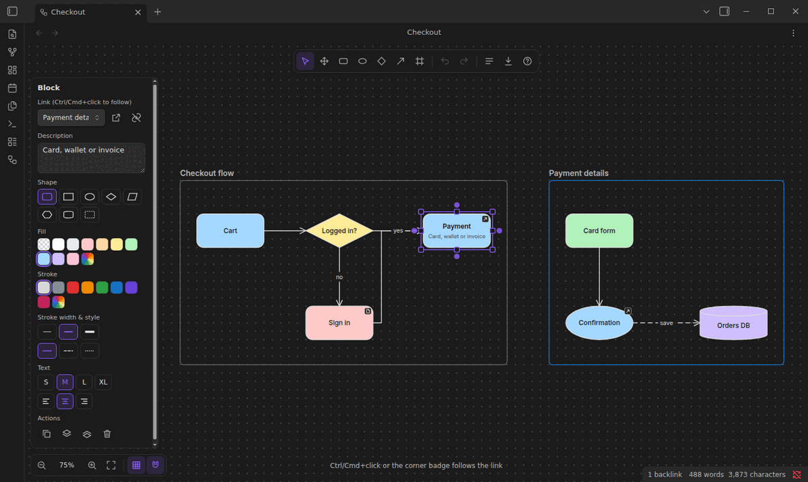
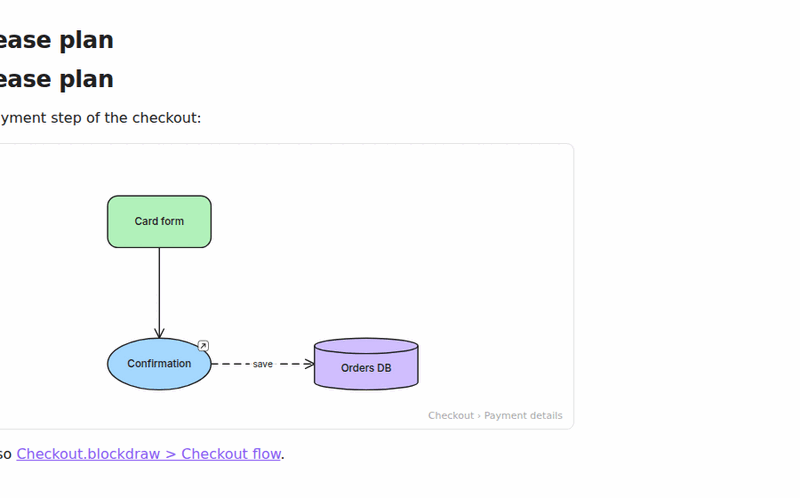
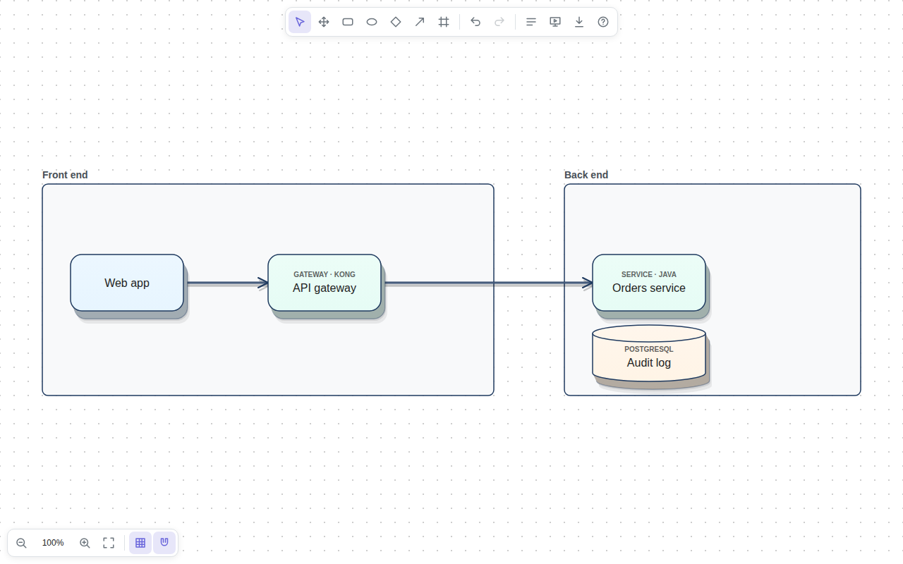
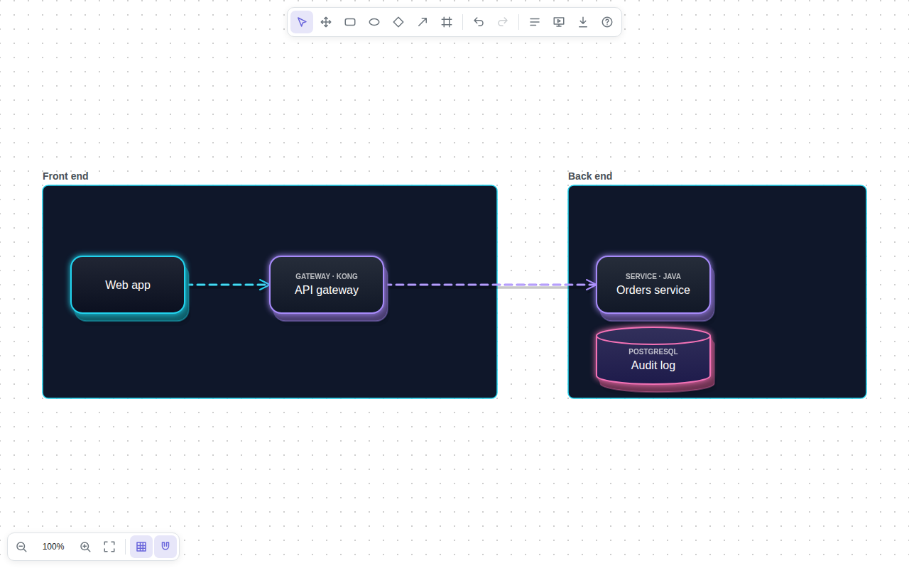
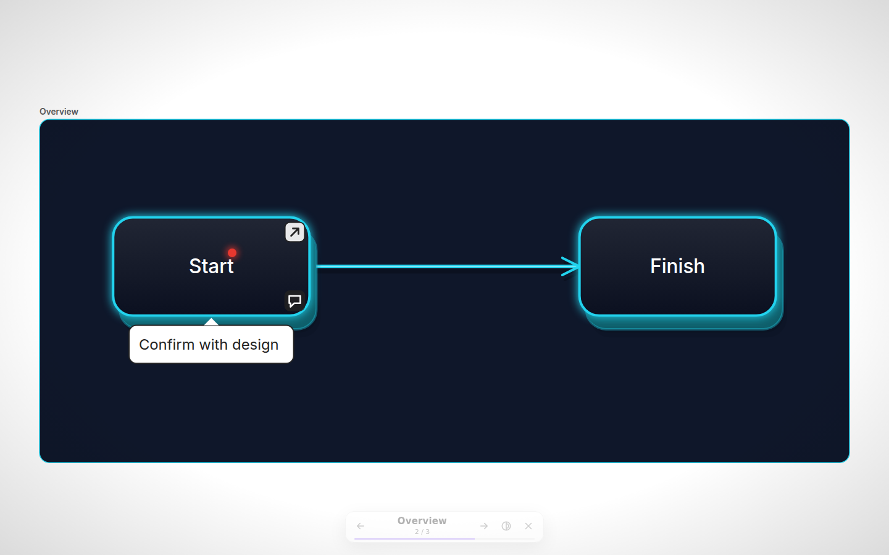
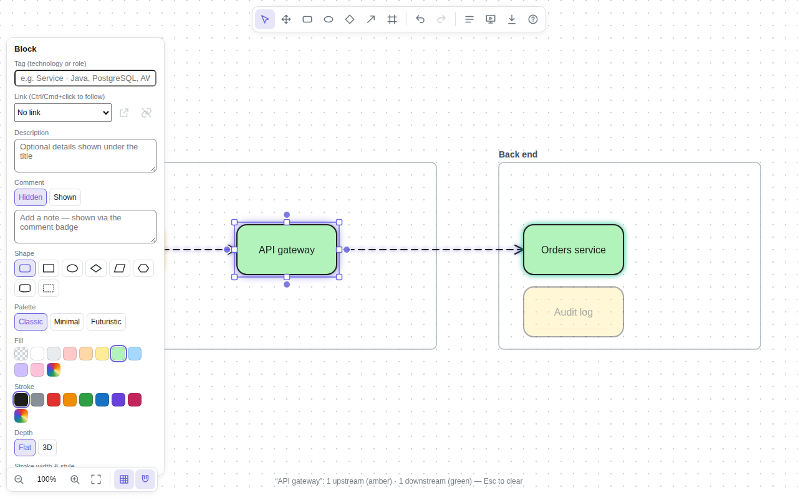
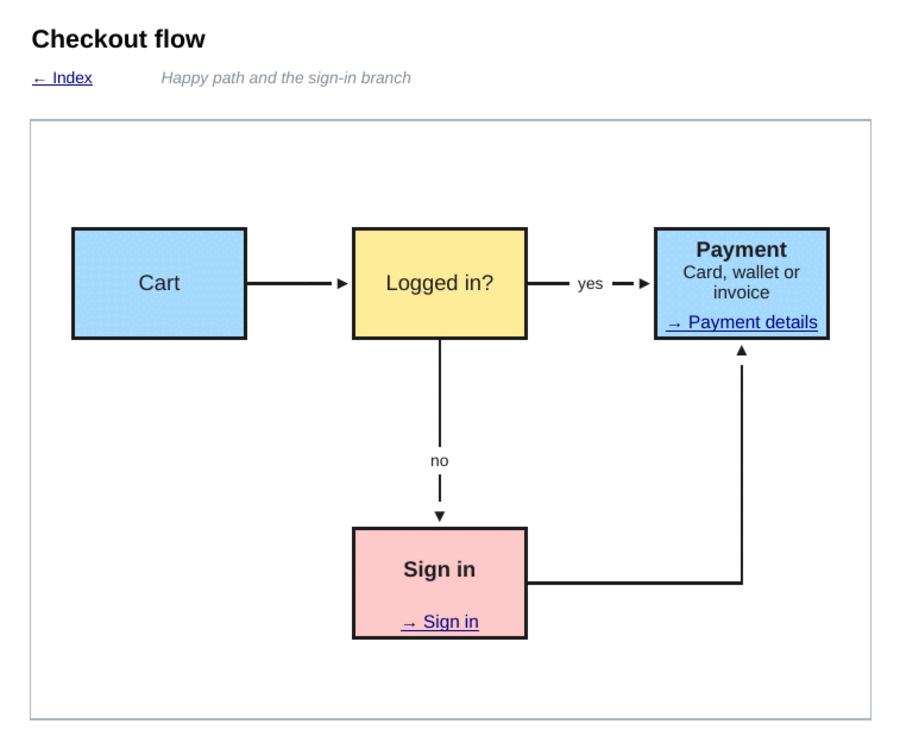
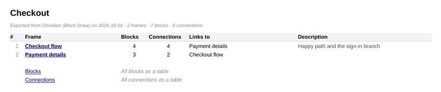

# Block Draw: design and reference

The [README](../README.md) is the short version. This document holds the detail: how each feature works, the export and file formats, how to set up Google Sheets, and how the code is put together.

**Contents**

- [Editing](#editing): [the basics](#the-basics), [keyboard shortcuts](#keyboard-shortcuts), [frames and links](#frames-and-links), [descriptions and comments](#descriptions-and-comments)
- [Look and feel](#look-and-feel): [themes, palettes and 3D](#themes-palettes-and-3d), [fonts](#fonts)
- [Presenting](#presenting)
- [For architects and engineers](#for-architects-and-engineers)
- [Exporting](#exporting): [the workbook](#what-the-workbook-looks-like), [Google Sheets setup](#setting-up-google-sheets-export), [JSON format](#json-format)
- [The `.blockdraw` file](#the-blockdraw-file)
- [Network use and privacy](#network-use-and-privacy)
- [Architecture](#architecture): [layers](#layers), [design decisions](#design-decisions), [testing](#testing)
- [Development](#development): [commands](#commands), [releasing](#releasing-a-new-version)

## Editing

### The basics

- **Canvas**: infinite canvas with pan and zoom, grid and snapping, undo/redo, copy/paste, duplicate (Ctrl/Cmd+D or Alt+drag), align and distribute, and single-key tool shortcuts.
- **Blocks with titles**: every block has a title and an optional description. Eight shapes (rounded, rectangle, ellipse, decision, input/output, preparation, database, text only) with fill, stroke, text size and alignment. Blocks grow to fit their text.
- **Connections**: hover a block and drag one of its edge dots onto another block. Drop on empty space to create a connected block, or click a dot to add one in that direction. Elbow, straight or curved lines, arrowheads, labels, and re-attachable ends. Connections follow their blocks.
- **Frames**: group blocks into frames (F). Moving a frame moves its blocks. The frames panel lists them in export order; click to jump, double-click to rename, reorder with the arrows.
- **Links between frames**: link any block to another frame (Ctrl/Cmd+K, the link dropdown, or right-click). Ctrl/Cmd+click the block or click its corner badge to jump there; **Back** (Alt+←) returns. Blocks can also link to notes, frames in other drawings, or URLs.
- **Deep links and embeds**: `[[Checkout.blockdraw#Payment details]]` opens a drawing at a frame, and a `blockdraw` code block shows a live preview of a drawing or of one frame inside a note.
- **Theme and devices**: follows Obsidian's light and dark theme, and works on desktop and mobile (tap, double-tap, pinch to zoom).



### Keyboard shortcuts

Press **?** in the editor for this list.

| Keys | Action |
| --- | --- |
| V / H (or hold Space) | Select / pan |
| B, O, D, R | Block, ellipse block, decision block, rectangle block |
| A or C | Connector tool |
| F | Frame tool |
| Double-click | Add a block, or edit the text under the pointer |
| Enter | Edit the selected element's text (Shift+Enter for a new line) |
| Ctrl/Cmd+K | Link the selected block |
| Ctrl/Cmd+click | Follow a block's link |
| [ and ] (or Page Up/Down) | Previous / next frame |
| Alt+← | Back to where you were before following a link |
| P | [Present](#presenting) |
| T | [Trace](#for-architects-and-engineers) the selected block's dependencies (Esc clears) |
| Ctrl/Cmd+Z, Ctrl/Cmd+Shift+Z | Undo, redo |
| Ctrl/Cmd+C / X / V / D | Copy, cut, paste, duplicate (or Alt+drag) |
| G | Grid on / off |
| Arrows (Shift = 5 steps) | Nudge |
| Shift+1 / Shift+2 / Shift+0 | Zoom to fit / to selection / 100% |
| Ctrl/Cmd+] / [ (with Shift: to front / back) | Bring forward / send backward |
| Delete | Delete the selection (a frame takes its blocks with it) |
| ? | Show all shortcuts |

### Frames and links

A block belongs to the frame its center is in. Deleting a frame deletes its blocks (undo brings them back).

A block's link can point to:

- **a frame in the same drawing** — following it pans and zooms to the frame; the **Back** button returns;
- **a note or file** — opens it (Ctrl/Cmd+click opens a new tab);
- **a frame in another drawing** — stored as `[[Other.blockdraw#Frame title]]`;
- **a URL** — opens in your browser.

From any note, `[[My drawing.blockdraw#Frame title]]` opens the drawing at that frame. To show a drawing inside a note, add a code block (or run **Insert preview of a drawing**):

````markdown
```blockdraw
file: Checkout.blockdraw
frame: Payment details
height: 320
```
````



### Descriptions and comments

Both are text you add in the properties panel (a description to a block, a comment to a block or a connector), and both have a **Hidden / Shown** switch.

A block's **description** is the text under its title. It is shown by default. Set it to **Hidden** (or choose **Hide description** / **Show description** in the right-click menu) to draw only the title and tag. A hidden description takes no room on the block and is left out of the canvas, embeds, SVG and PNG exports and the Excel and Sheets grid, but the text is kept: it is still in the JSON export (`descriptionOpen: false`), on the workbook's Blocks tab and in each frame's text table.

A **comment** is an aside on a block or a connector. A small badge on the canvas shows that one exists; click it (or use the panel's **Shown / Hidden** switch, or **Show comment** / **Hide comment** in the right-click menu) to expand or collapse the note. The open/closed state is saved with the drawing, so a comment left open stays visible in read-only embeds and in SVG/PNG exports. **Remove comment** clears it. Comments appear in the JSON, Excel and Google Sheets exports whether open or not. While [presenting](#presenting), clicking a badge shows or hides the comment for the presentation only, without changing the drawing.

The difference: a description is part of the block's content, while a comment stays out of the way until you open it.

## Look and feel

### Themes, palettes and 3D



**One-click themes** restyle the whole drawing — or just the selection — in a single undoable step. Right-click the empty canvas, use the **Quick theme** buttons in the properties panel, or run *Apply theme: …* from the command palette:

| Theme | Look |
| --- | --- |
| 3D | Soft board-room colors, navy lines, raised 3D blocks and links |
| Minimal | White and grey, fine lines, flat |
| Futuristic | Deep navy tiles with neon edges and glow, in 3D |
| Classic | The original pastel colors, flat |

Themes keep your color coding: blocks that shared a color before still share one afterwards. Shapes, text, links and positions are never touched. The theme also becomes the style for blocks and connectors you add next.

**Palettes**: the **Palette** row in the properties panel switches the swatches between *3D*, *Classic*, *Minimal* (neutrals with one accent) and *Futuristic* (navy and neon).

**3D effect**: set **Depth → 3D** for blocks or **Effect → 3D** for connectors in the properties panel, use **3D effect** in the right-click menu, or run *Toggle 3D effect* (selection, or the whole drawing when nothing is selected). 3D blocks are extruded tiles with a top-lit face and a calibrated soft shadow; on dark fills the sides take the block's edge color and the edge glows. 3D links get a drop shadow and a sheen. The effect is part of the drawing, so it shows in embeds and in SVG and PNG exports.



### Fonts

Choose from the **10 most used fonts in the world for business presentations** in the properties panel under **Text** (applied to block **Titles**, **Descriptions**, **Tags**, and **Links**):
- **Inter**: Modern tech & clean digital UI standard (default)
- **Segoe UI**: Microsoft corporate & enterprise standard (PowerPoint / Office)
- **Roboto**: Google & Android clean geometric standard
- **Arial / Helvetica**: Universal corporate boardroom classic
- **Calibri**: Microsoft PowerPoint & Office classic default for 16+ years
- **Aptos**: Microsoft 365 modern presentation default
- **Open Sans**: High-legibility slide decks & consulting reports
- **Montserrat**: High-impact startup pitch decks & geometric headings
- **Lato**: Warm corporate & management consulting favorite
- **Georgia**: Authoritative digital editorial & executive prestige serif

## Presenting



Press **P** (or the toolbar's screen icon, or *Present drawing* in the command palette). The drawing goes full screen with every panel hidden: first an overview of the whole drawing, then one slide per frame, in the frames panel's order, with an animated move between slides.

| Keys | Action |
| --- | --- |
| → ↓ Space Page Down | Next slide |
| ← ↑ Page Up | Previous slide |
| 1–9, Home, End | Jump to a slide |
| Click a block | Spotlight it and its dependencies with live legend; click empty space to clear |
| Click a comment badge | Show or hide that comment (the drawing is not changed) |
| Click a link badge | Jump to the linked frame's slide |
| S | Switch between your theme and a dark stage |
| L | Laser pointer on / off |
| ? | Toggle presentation guide & shortcut cheat sheet |
| Esc | Clear the spotlight, then end the presentation |

Nothing can be edited while presenting, and your view is restored afterwards.

## For architects and engineers



- **Dependency tracing**: select a block and press **T** (or right-click → *Trace dependencies*). Blocks it depends on glow amber (upstream, against the arrows), blocks that depend on it glow green (downstream, along the arrows), the paths between them animate, and everything else fades. The hint bar counts both sides. Cycles are handled. Esc clears it.
- **Animated flow**: set a connector's **Effect** to **Flow** and dashes march along it, on the canvas and in embedded previews (static in exported images). The dashes follow the arrowheads: toward the end when the arrow is at the end (or there is none), toward the start when the arrow is only at the start. A link with arrowheads at **both** ends is drawn as two parallel lanes whose dashes move in opposite directions. The same applies while a trace animates a link. Respects the system's reduced-motion setting.
- **Tags**: give a block a technology or role in the **Tag** field (“Service · Java”, “Queue · Kafka”, “PostgreSQL”). It is shown in small capitals above the title, like a C4 stereotype, and exported in the JSON (`tag`) and in the workbook's Blocks tab.

## Exporting

| Export | Where it goes |
| --- | --- |
| Google Sheets | A spreadsheet in your Google Drive (see setup below) |
| Excel workbook (.xlsx) | Next to the drawing (or the export folder from settings) |
| JSON | `<drawing>.json`, or **Copy JSON to clipboard** |
| SVG / PNG | The whole drawing, or only the selected frame |

### What the workbook looks like

The Google Sheets and Excel exports build the same workbook:

- **Index** tab: every frame with a link to its tab, block and connection counts, the frames it links to and its description.
- **One tab per frame**, drawn on a grid of small square cells: blocks are filled, outlined cells; connections are routed along cell borders with arrowheads and labels; frame titles and descriptions sit on top with a link back to the index. A block that links to a frame gets a **→ Frame name** link that jumps to that frame's tab. Hover a block (or a labeled connection) for a note with its comment and connections. Beside the grid, a plain table lists the frame's blocks as text — **Block Title**, **LinkTo** and **LinkFrom** (its outgoing and incoming connections), **Block Description** and **Notes** (its comment) — so the frame reads without the diagram too.
- **Canvas** tab for blocks that are not in any frame, with the same textual table.
- **Blocks** and **Connections** tabs listing every element across all frames as a filterable row (frame, title, description, shape or line, comment, tag, links, incoming and outgoing connections). Internal element ids are never shown.

A block whose description is hidden is drawn without it on the grid, but its description still appears in the tables.





Exporting a drawing to Google Sheets again **updates the same spreadsheet**: the tabs it created are replaced, tabs you added yourself are kept. Use **Export to a new Google Sheet** to start over. Cell size, the extra tabs and this behavior can be changed in settings.

### Setting up Google Sheets export

Choose a connection method in **Settings → Block Draw → Google Sheets**.

#### Apps Script web app (recommended, works on mobile)

A tiny script in your own Google account receives the sheet data from Obsidian and writes it with the Google Sheets API. No Google Cloud project is needed.

1. In the plugin settings, click **Generate** next to *Apps Script secret*, then **Copy code**. The code is also in [`apps-script/Code.gs`](../apps-script/Code.gs).
2. Open [script.google.com](https://script.google.com), create a project and replace the contents of `Code.gs` with the copied code. If you copied the file from this repository instead, set `SECRET` at the top to the secret from the settings.
3. In the editor sidebar, click **Services (+)**, choose **Google Sheets API** and click **Add**.
4. Click **Deploy → New deployment**, select the type **Web app**, set *Execute as* to **Me** and *Who has access* to **Anyone**, then **Deploy** and authorize the script.
5. Copy the web app URL (it ends in `/exec`) into *Web app address* and click **Test**.

"Anyone" is required because Obsidian cannot sign in to your Google account. The script rejects every request that does not carry your secret, and it only creates and updates spreadsheets. If you edit the script later, publish it with **Deploy → Manage deployments → Edit → Version: New version** so the URL stays the same. Some Google Workspace organizations do not allow "Anyone" access; use the Google account method there.

If the export or the **Test** button fails, the message says what to fix:

| Message | Cause |
| --- | --- |
| Google asked to sign in instead of running the script | The deployment's *Who has access* is not **Anyone** (for example "Anyone with Google account"). Edit the deployment, set it to **Anyone** and deploy a new version. |
| The web app address ends in "/dev" | That is the editor's test link. Use the address from **Deploy → Manage deployments**, which ends in `/exec`. |
| Google Apps Script returned an error page | Deploy the latest code as a new version, and check that the address ends in `/exec`. |
| The Apps Script web app returned an empty response | Open the address once in a browser while signed in to the account that deployed it, finish any sign-in or permission prompt, then deploy a new version. |
| The Apps Script secret does not match | The secret in the settings differs from `SECRET` in the script. |

#### Google account (desktop only)

Calls the Google Sheets API directly after you sign in. It asks only for the `drive.file` permission: access to the spreadsheets Block Draw creates, nothing else in your Drive.

1. In the [Google Cloud console](https://console.cloud.google.com/), create a project and enable the **Google Sheets API**.
2. Configure the OAuth consent screen (user type *External*) and add yourself as a test user. Publishing the app avoids having to sign in again every 7 days.
3. Create an **OAuth client ID** of type **Desktop app** and paste its client ID and client secret into the settings.
4. Click **Sign in with Google** and approve access in your browser.

The sign-in token is stored on this device only (in Obsidian's secret storage when available), never in the synced plugin settings.

### JSON format

The **structured** format (default) is meant for other tools: frames in order, each with its blocks in reading order and the connections inside it, block positions relative to their frame, and links resolved to frame titles.

```json
{
  "format": "block-draw/export",
  "version": 1,
  "name": "Checkout",
  "frames": [
    {
      "id": "f1",
      "order": 1,
      "title": "Checkout flow",
      "description": "Happy path and the sign-in branch",
      "bounds": { "x": 0, "y": 0, "width": 780, "height": 440 },
      "blocks": [
        {
          "id": "pay",
          "title": "Payment",
          "tag": "Service",
          "description": "Card, wallet or invoice",
          "descriptionOpen": true,
          "comment": "",
          "commentOpen": false,
          "shape": "rounded",
          "bounds": { "x": 580, "y": 80, "width": 160, "height": 80 },
          "link": { "type": "frame", "frameId": "f2", "frameTitle": "Payment details" },
          "outgoing": [],
          "incoming": ["c2", "c4"]
        }
      ],
      "connections": [
        {
          "id": "c2",
          "from": { "blockId": "check", "blockTitle": "Logged in?", "frameId": "f1", "frameTitle": "Checkout flow", "side": "auto" },
          "to": { "blockId": "pay", "blockTitle": "Payment", "frameId": "f1", "frameTitle": "Checkout flow", "side": "auto" },
          "label": "yes",
          "comment": "",
          "commentOpen": false,
          "routing": "elbow"
        }
      ],
      "linksTo": [{ "frameId": "f2", "title": "Payment details" }],
      "linkedFrom": [{ "frameId": "f2", "title": "Payment details" }]
    }
  ],
  "unframed": { "blocks": [], "connections": [] },
  "crossFrameConnections": [],
  "stats": { "frames": 2, "blocks": 7, "connections": 6 }
}
```

(Styles, canvas positions and timestamps are included too; shortened here.) The **raw** format is the drawing file itself.

## The `.blockdraw` file

Drawings are plain JSON with one element per line, so they diff nicely in git:

```json
{
	"type": "block-draw",
	"version": 1,
	"elements": [
		{"id":"f1","type":"frame","x":0,"y":0,"width":780,"height":440,"title":"Checkout flow","description":"","style":{"fill":"transparent","stroke":"default"}},
		{"id":"pay","type":"block","x":580,"y":80,"width":160,"height":80,"title":"Payment","description":"Card, wallet or invoice","descriptionOpen":true,"shape":"rounded","frameId":"f1","link":"frame:f2","tag":"Service","comment":"","commentOpen":false,"style":{"fill":"#a5d8ff","stroke":"default","strokeWidth":2,"strokeStyle":"solid","textColor":"auto","fontSize":16,"textAlign":"center","threeD":true,"fontFamily":"inter"}},
		{"id":"c2","type":"connector","from":{"id":"check","side":"auto"},"to":{"id":"pay","side":"auto"},"label":"yes","routing":"elbow","comment":"","commentOpen":false,"style":{"stroke":"default","strokeWidth":2,"strokeStyle":"solid","startArrow":"none","endArrow":"arrow","threeD":false,"flow":true}}
	]
}
```

Block links are `frame:<frame id>`, `[[wikilink]]` or a URL. After a Google Sheets export the file also remembers the spreadsheet (`exports.googleSheet`) so the next export can update it. A file that cannot be read is shown as an error and never overwritten.

Fields added in later versions (`tag`, `descriptionOpen`, `threeD`, `flow`, `fontFamily` and so on) have defaults, so drawings saved by older versions open unchanged. Unknown top-level keys written by newer versions are kept when the file is saved.

If you use Obsidian Sync, turn on syncing of **other file types** in its settings so `.blockdraw` files are synced too.

## Network use and privacy

Block Draw works offline: drawing, saving and the JSON, Excel, SVG and PNG exports stay on your device. It uses the network in these cases, and only to Google:

- **Web fonts**: the plugin's stylesheet imports its presentation fonts from Google Fonts (`fonts.googleapis.com`, which serves font files from `fonts.gstatic.com`) when Obsidian loads it. SVG exports and note embeds carry the same import. Without a connection the fonts fall back to the system fonts.
- **Google Sheets export, Apps Script web app**: the workbook goes to the web app you deployed in your own Google account (`script.google.com`), which writes it to your Google Drive.
- **Google Sheets export, Google account** (desktop): signing in goes through `accounts.google.com` and `oauth2.googleapis.com`, and the workbook goes straight to the Google Sheets API (`sheets.googleapis.com`), with access limited to the spreadsheets Block Draw creates.

Only Google Sheets export needs a Google account. There is no telemetry and there are no ads, and no other servers are contacted.

## Architecture

Block Draw is a TypeScript Obsidian plugin, bundled by esbuild into a single `main.js` (plus `styles.css`). The code is layered so that everything that draws, edits and exports a diagram is independent of Obsidian; only `src/obsidian` and `src/main.ts` talk to the app.

### Layers

| Folder | Role | Uses |
| --- | --- | --- |
| `src/model` | Elements, file format, scene operations, undo history, themes, dependency graph | `geometry` (helpers), `render/fonts` (the list of font ids) |
| `src/geometry` | Shapes, hit-testing helpers, connector routing, polyline math | `model` (types) |
| `src/render` | Turns elements into a virtual SVG tree: blocks, connectors, frames, comments, text layout, colors, fonts | `geometry`, `model` |
| `src/editor` | The canvas editor: pointer and keyboard handling, selection, viewport, panels, inline text editing, presentation | `render`, `geometry`, `model` |
| `src/export` | JSON, workbook layout, XLSX writer, Google Sheets requests and transports | `render`, `geometry`, `model` |
| `src/obsidian` | The Obsidian view, settings tab, link picker, exports, Google sign-in, embeds | `editor`, `export`, `render`, `model` |
| `apps-script` | The Google Apps Script bridge for Sheets export (runs in Google, not in the plugin) | nothing |

`src/main.ts` is the plugin entry point (commands, menus, ribbon, file creation). It and the files in `src/obsidian` are the only code that imports Obsidian, so the editor, renderer and exporters run unchanged in the browser test harness. Dependencies run roughly downwards, from `obsidian` through `editor` and `export` to `render`, `geometry` and `model`; the exceptions are that `model` and `geometry` use each other's basic types and helpers, and that the model reads the font id list from `render/fonts`.

### Design decisions

- **Immutable elements.** Blocks, connectors and frames are plain objects; every edit produces a new object. Undo history stores snapshots of the element array that share all unchanged elements, so it is cheap, and the renderer can tell what changed with an identity check.
- **One renderer for everything.** `src/render` builds a small virtual-node tree. The editor turns it into live SVG DOM, while exports and note embeds turn the same tree into an SVG string, so a drawing looks the same everywhere. Blocks, connectors, frames, comment callouts, 3D effects and flow lanes are all produced there.
- **Keyed layers in the editor.** `SceneRenderer` keeps layers in a fixed order (frames, connectors, labels, blocks, comments, overlay). Each item declares the values it depends on and its DOM is rebuilt only when one of them changes. Comment callouts have their own layer above blocks and connectors, so nothing is drawn over them.
- **Hit testing by geometry, not by DOM.** `Editor.hitTest(point)` returns a tagged result (handle, badge, block, connector, frame). The pure helpers that decide where a badge or a label sits are shared by drawing and by interaction, which keeps them from drifting apart and lets the presenter reuse the same logic.
- **Saved state versus view state.** What belongs to the drawing is in the elements and saved: positions, styles, theme, 3D, tags, `descriptionOpen`, `commentOpen`. What belongs to the view is not: selection, viewport, the dependency trace, and the comments a presenter opens or closes by clicking (`Presenter.commentOverrides`). Presenting therefore never modifies the file.
- **Text layout in one place.** `layoutBlockText` wraps and positions a block's tag, title and visible description for both the renderer and the automatic block height, using canvas text measurement with a deterministic estimate when no canvas exists (tests).
- **Connector routing.** Elbow routes try each pair of sides and several orthogonal candidate paths and keep the cheapest (short, few bends, not crossing the blocks); curved routes are cubic Béziers; `trimRoute` shortens a route for its arrowheads. The spreadsheet exporter reuses the router on a grid through its `quantize`, `anchor` and `extraCost` options. A two-way flowing link gets two lanes by offsetting the route's polyline (`offsetPolyline`) to either side, one drawn start to end and one end to start, so the same dash animation runs both ways.
- **Editor host.** The editor never imports Obsidian. It talks to its environment through the `EditorHost` interface (menus, notices, link picker, opening links, export menu), which the Obsidian view and the browser test harness each implement.
- **Export pipeline.** `buildWorkbook()` turns a drawing into a backend-neutral `WorkbookModel`: sheets of cells with styles, merges, borders, links and notes. `writeXlsx()` serializes it to a real `.xlsx` (zip and XML written by hand with `fflate`). `src/export/gsheets/requests.ts` converts the same model to Google Sheets `batchUpdate` requests, and `exporter.ts` creates or updates the spreadsheet, replacing only the tabs a previous export created.
- **Two Sheets transports** behind one `SheetsTransport` interface: the Apps Script bridge (`AppsScriptTransport`) and the Sheets REST API with an OAuth token (`RestSheetsTransport`, PKCE loopback sign-in in `googleAuth.ts`). All HTTP goes through Obsidian's `requestUrl`, which has no CORS restrictions and works on mobile.
- **Apps Script bridge.** `apps-script/Code.gs` always answers with JSON, even on errors, checks a shared secret and forwards `ping`, `create`, `get` and `batchUpdate` to the Sheets advanced service. Google answers a web-app POST with a redirect to a one-time content URL; `requestUrl` follows it. A reply that is not JSON therefore means Google answered before the script ran, and the transport explains the likely cause.
- **Tolerant file format.** `parseDrawing` validates and repairs what it reads: it fills defaults for fields that older files lack, drops connectors whose ends are gone and frame references that point nowhere, and keeps unknown top-level keys.

### Testing

- **Unit tests** (`npm test`, Vitest) cover the model, geometry and routing, rendering, text layout, themes and tracing, the workbook layout and XLSX writer, the Sheets request builder (every request validated against a trimmed copy of Google's Sheets API schema in `tests/fixtures`) and the real `apps-script/Code.gs`, run in a sandbox against an in-memory Sheets service.
- **Editor UI tests** (`npm run test:ui`, `tests/harness`) run the editor in Chromium with real pointer and keyboard input, through a small harness that implements `EditorHost`. They never use the network: the stylesheet's web-font import is answered locally.
- **End-to-end tests** (`npm run test:e2e`, `tests/e2e`) drive the real Obsidian desktop app over the Chrome DevTools protocol: drawing, saving, frame links, exports, themes, presenting, settings and embeds, with a local stand-in for the Apps Script web app that behaves like Google's (POST answered with a redirect to a content URL). They pass on Obsidian 1.5.3, the oldest version the manifest allows, and on current releases.
- **CI** (`.github/workflows/ci.yml`) runs lint, unit tests, the build and the UI tests on every push.

## Development

### Commands

```bash
npm install
npm run dev        # rebuild main.js on change
npm run build      # type check and production build
npm run lint       # ESLint with Obsidian's recommended rules
npm test           # unit tests (model, routing, workbook layout, XLSX, Sheets requests, Apps Script bridge)
npm run test:ui    # editor tests in Chromium (set CHROMIUM_PATH if Chromium is elsewhere)
OBSIDIAN_BIN=/path/to/obsidian npm run test:e2e   # end-to-end tests in the Obsidian desktop app
```

Set `SHOTS=<dir>` to save screenshots from the UI and end-to-end tests, and `PLUGIN_DIR` to run the end-to-end tests against files downloaded from a release instead of the local build. `OBSIDIAN_BIN` is the Obsidian executable, for example from `Obsidian-x.y.z.AppImage --appimage-extract`.

### Releasing a new version

1. Add a `## x.y.z` section to `CHANGELOG.md` and commit it.
2. Run `npm version x.y.z`. It updates `package.json`, `manifest.json` and `versions.json`, commits, and creates the tag `x.y.z` (no `v`, as Obsidian requires).
3. Run `git push --follow-tags`. The release workflow checks that the tag matches the manifest, runs the tests, and publishes a GitHub release with `main.js`, `manifest.json` and `styles.css`, signed with [artifact attestations](https://docs.github.com/en/actions/security-guides/using-artifact-attestations-to-establish-provenance-for-builds), using the changelog section as release notes. Obsidian, BRAT and the community directory pick up new versions from these releases.

Instead of pushing a tag, you can push the version commit and run the **Release** workflow from the Actions tab; it tags the commit with the version from `manifest.json`.

See [CONTRIBUTING.md](../CONTRIBUTING.md) for how to report bugs and open pull requests.
